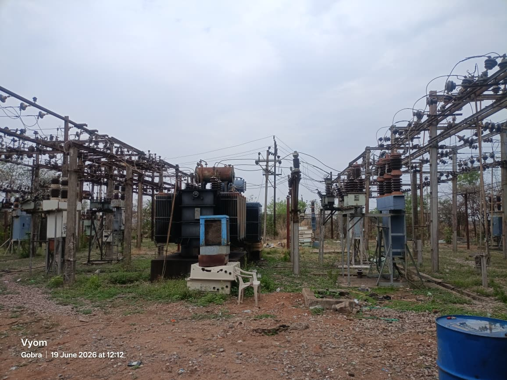
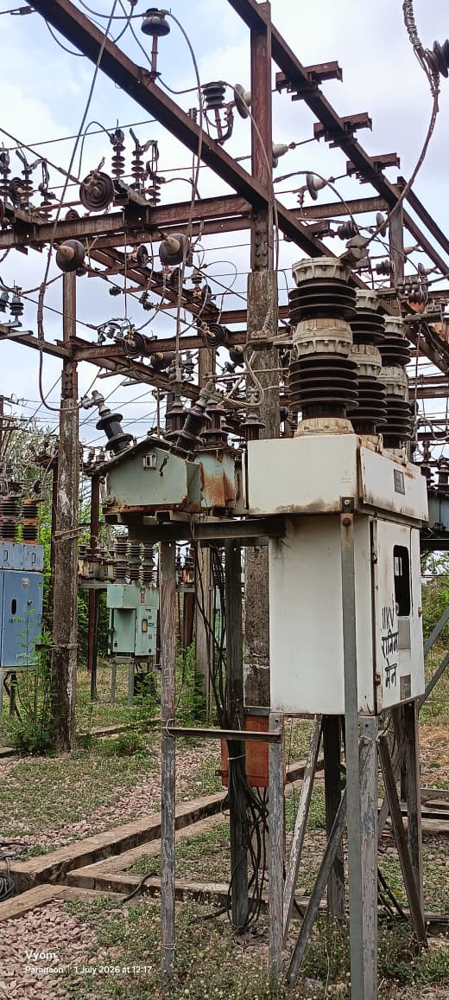
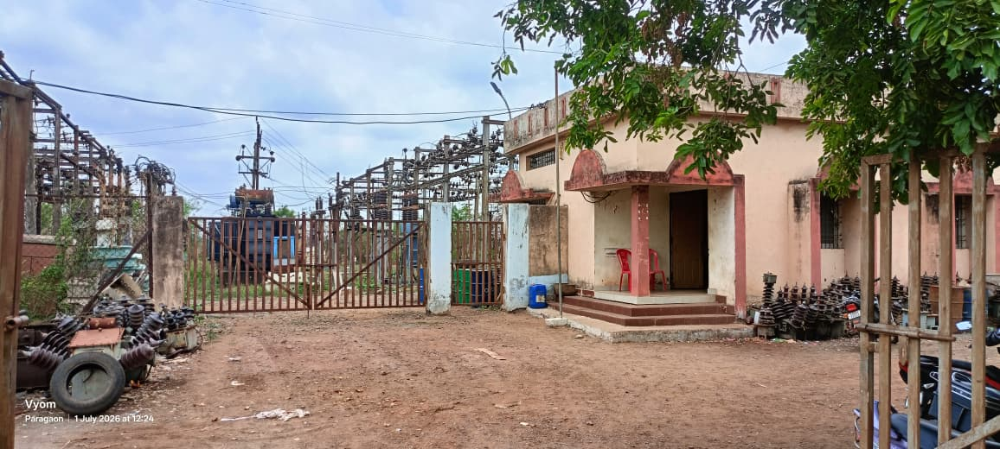
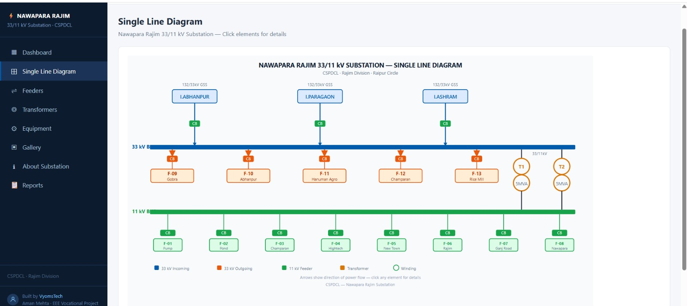
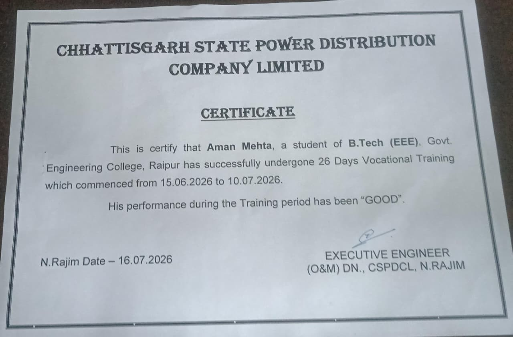

<div align="center">

# ⚡ NAWAPARA RAJIM 33/11 kV SUBSTATION ⚡
### Digital Single Line Diagram & Monitoring Dashboard

**CSPDCL** · Rajim Division · Raipur Circle

[](https://cspdcl.netlify.app/)
[]()
[]()
[](https://cspdcl.netlify.app/)

**🔗 [https://cspdcl.netlify.app/](https://cspdcl.netlify.app/)**

</div>

⎯⎯⎯⎯⎯⎯⎯⎯⚡⎯⎯⎯⎯⎯⎯⎯⎯

## 🧭 Overview

This project takes the substation's actual single line diagram, feeder network, transformers, and protection equipment — normally locked away in paper registers — and energizes them into a **live, clickable web dashboard**. Built as part of 6th-semester EEE vocational training at CSPDCL.

⎯⎯⎯⎯⎯⎯⎯⎯⚡⎯⎯⎯⎯⎯⎯⎯⎯

## 🔌 Substation Nameplate

| Parameter | Rating |
|---|---|
| ⚡ Voltage Level | 33 / 11 kV |
| 🔋 Installed Capacity | 2 × 5 MVA |
| 🏭 Power Transformers | 2 |
| 📥 Incoming Feeders | 3 |
| 📤 Outgoing Feeders | 13 *(5 × 33 kV + 8 × 11 kV)* |
| 🌀 Frequency | 50 Hz |
| 🔺 System | 3-Phase |
| 📅 Commissioned | 2008 |
| 📍 Division / Circle | Rajim Division / Raipur Circle |

⎯⎯⎯⎯⎯⎯⎯⎯⚡⎯⎯⎯⎯⎯⎯⎯⎯

## 📸 Screenshots

<!-- Drop screenshots into images/screenshots/ with these exact filenames -->


| Feeders | Transformers |
|---|---|
|  |  |

| Equipment | Gallery |
|---|---|
|  |  |

⎯⎯⎯⎯⎯⎯⎯⎯⚡⎯⎯⎯⎯⎯⎯⎯⎯

## 🗺️ Additional Single Line Diagram

<!-- Hand-drawn/separate SLD — drop it at images/sld.jpeg -->



⎯⎯⎯⎯⎯⎯⎯⎯⚡⎯⎯⎯⎯⎯⎯⎯⎯

## 🎓 Vocational Training Certificate

<!-- Certificate — drop it at images/certificate.jpeg -->



⎯⎯⎯⎯⎯⎯⎯⎯⚡⎯⎯⎯⎯⎯⎯⎯⎯

## ✨ Features

| Module | Description |
|---|---|
| ▦ **Dashboard** | Live overview — bus status, load %, power availability, key stats |
| ⊞ **Single Line Diagram** | Interactive SVG — click any breaker, feeder, or transformer for full details; pinch-to-zoom on mobile |
| ⇌ **Feeders** | All 16 feeders (3 incoming · 5×33kV out · 8×11kV out) with load, current, source/destination, conductor, CB/CT/PT/LA ratings |
| ◎ **Transformers** | 2 × 5 MVA units — load, temperature, oil level, maintenance history |
| ⚙ **Equipment** | Categorized registers for Circuit Breakers, CTs, PTs, and Lightning Arresters |
| ▣ **Gallery** | Substation photo gallery |
| ℹ **About** | Commissioning details, capacity, division/circle info |
| 📋 **Reports** | Daily load, outage, maintenance, monthly, trip history, equipment test reports |
| 🔐 **Admin Panel** | PIN-protected login, CRUD modals for data/images, localStorage-backed |

⎯⎯⎯⎯⎯⎯⎯⎯⚡⎯⎯⎯⎯⎯⎯⎯⎯

## 🛠️ Tech Stack

- ⚡ HTML5, CSS3, vanilla JavaScript — single-file architecture, zero dependencies
- 🔷 SVG — interactive single line diagram
- 💾 `localStorage` — admin-managed data persistence
- ☁️ Hosted on **Netlify**

⎯⎯⎯⎯⎯⎯⎯⎯⚡⎯⎯⎯⎯⎯⎯⎯⎯

## 📁 Image Folder Structure

```
images/
├── screenshots/
│   ├── dashboard.png
│   ├── sld.png
│   ├── feeders.png
│   ├── transformers.png
│   ├── equipment.png
│   └── gallery.png
├── sld.jpeg            ← separate/hand-drawn SLD
├── certificate.jpeg     ← vocational training certificate
├── feeders/
├── transformers/
├── gallery/
└── equipment/
```

⎯⎯⎯⎯⎯⎯⎯⎯⚡⎯⎯⎯⎯⎯⎯⎯⎯

## 🚀 Deployment

This is a static site — no build step required.

1. Push changes to the connected GitHub repo
2. Netlify auto-deploys from the main branch
3. Live at [cspdcl.netlify.app](https://cspdcl.netlify.app/)

To run locally, just open `index.html` in a browser — no server needed.

⎯⎯⎯⎯⎯⎯⎯⎯⚡⎯⎯⎯⎯⎯⎯⎯⎯

## 👤 Credits

Built by Aman Mehta
Founder, [VyomsTech](https://vyomstech.netlify.app) · EEE Student, Government Engineering College, Raipur

Developed as part of CSPDCL vocational training documentation.

<div align="center">

⎯⎯⎯⎯⎯⎯⎯⎯⚡⎯⎯⎯⎯⎯⎯⎯⎯

**CSPDCL · Rajim Division · Raipur Circle**

</div>